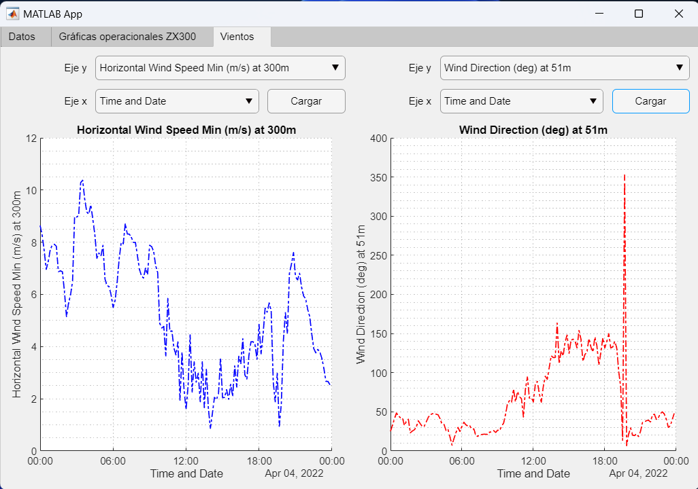

# Lidar-Zephir

Aplicación básica para el análisis de datos del Lídar Zephir Z300 de la universidad de León. Actualmente funciona cargando los datos del sensor, se puede realizar su automatizazion cargando los datos generados cada 10 minutos mediante un sencillo script de Python

## Interfaz gráfica
- Carga de datos

- Estudio de las variables operacionales del lídar

- Estudio de las variables captadas por la estación meteorológica

